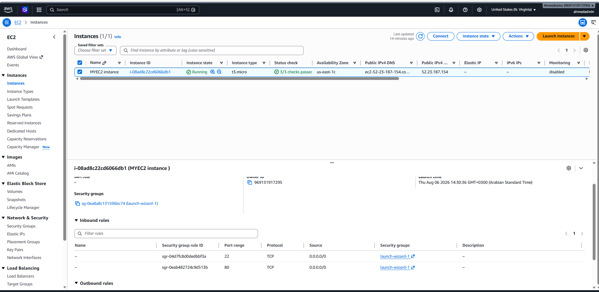
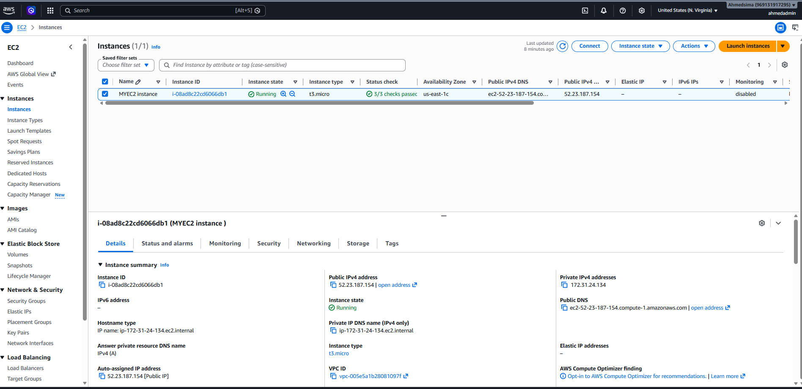
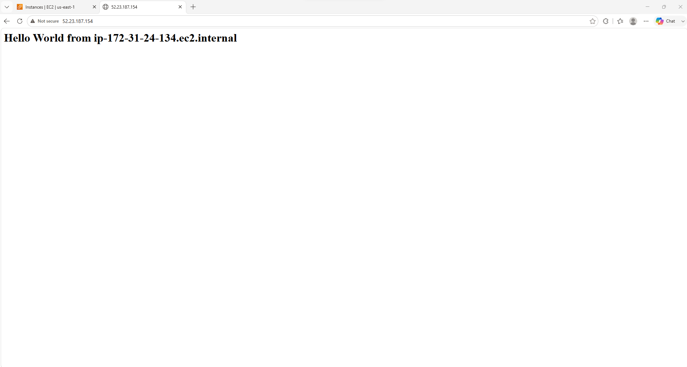

# Automated Web Server Deployment on AWS EC2 via User Data

## Project Overview
This project demonstrates how to launch an Amazon EC2 instance and automatically deploy an Apache web server upon boot using EC2 User Data (Bootstrap Script).

## Architecture & Key Steps
1. **Security Group Setup:** Configured inbound rules to allow HTTP (Port 80) and SSH (Port 22) traffic.
2. **User Data Configuration:** Embedded a Bash script to update system packages, install Apache (`httpd`), start the service, and generate a dynamic HTML home page displaying the server's hostname.
3. **Deployment & Verification:** Launched the EC2 instance and accessed the web application using its public IP address.

## Project Screenshots

### 1. Security Group Configuration

### 2. EC2 Instance Running Status

### 3. Deployed Web Application Result

